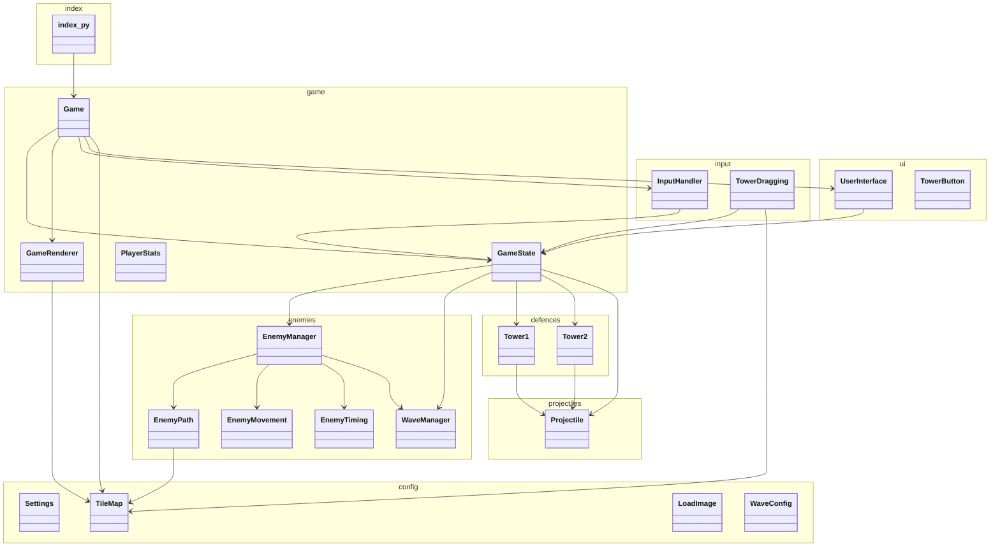

## Sovelluksen arkkitehtuuri

Sovelluksen pakkauskaavio:

```mermaid
classDiagram

namespace index {
  class index_py
}

namespace game {
  class Game
  class GameState
  class GameRenderer
  class PlayerStats
}

namespace config {
  class Settings
  class TileMap
  class LoadImage
  class WaveConfig
}

namespace enemies {
  class EnemyManager
  class EnemyPath
  class EnemyMovement
  class EnemyTiming
  class WaveManager
}

namespace defences {
  class Tower1
  class Tower2
}

namespace projectiles {
  class Projectile
}

namespace input {
  class InputHandler
  class TowerDragging
}

namespace ui {
  class UserInterface
  class TowerButton
}

%% Entry point
index_py --> Game

%% Game core dependencies
Game --> GameState
Game --> GameRenderer
Game --> InputHandler
Game --> UserInterface

%% GameState dependencies
GameState --> EnemyManager
GameState --> WaveManager
GameState --> Tower1
GameState --> Tower2
GameState --> Projectile

%% Enemy system
EnemyManager --> EnemyPath
EnemyManager --> EnemyMovement
EnemyManager --> EnemyTiming
EnemyManager --> WaveManager

%% Towers and projectiles
Tower1 --> Projectile
Tower2 --> Projectile

%% Input & UI
InputHandler --> GameState
TowerDragging --> GameState
TowerDragging --> TileMap
UserInterface --> GameState

%% Config usage
Game --> TileMap
GameRenderer --> TileMap
EnemyPath --> TileMap

```

Sekvenssikaavio pelin käynnistämisestä:

